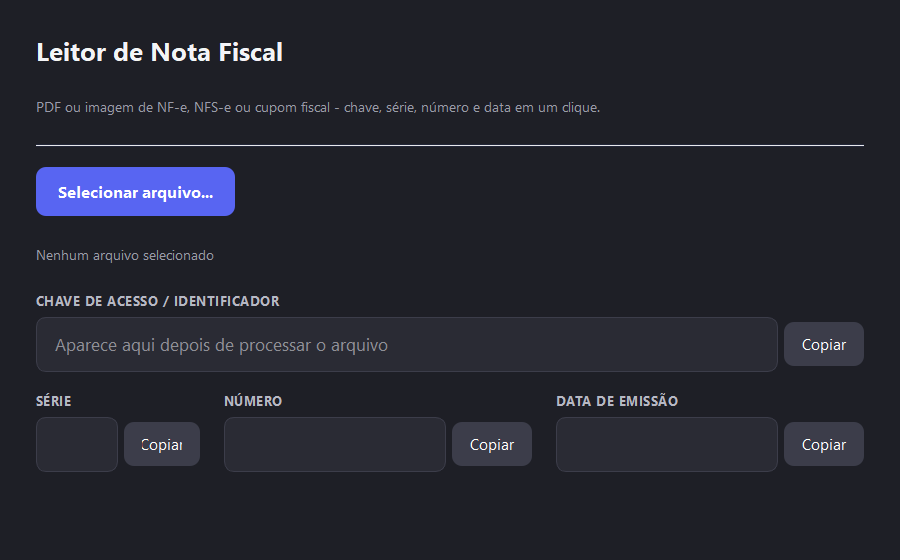

# Leitor de Nota Fiscal

App desktop para Windows que extrai automaticamente a **chave de acesso, série, número e data de emissão** de notas fiscais a partir de um PDF ou imagem — sem precisar abrir o arquivo e copiar manualmente.

Suporta **NF-e** (nota fiscal eletrônica de produto), **NFS-e** (nota fiscal de serviço) e **cupom fiscal**.

---

## Como funciona

1. Você seleciona o arquivo (PDF ou imagem)
2. O app extrai o texto — direto do PDF se for digital, ou via OCR se for escaneado ou imagem
3. Os dados aparecem em campos separados, cada um com botão de copiar

| Tipo de arquivo | Estratégia |
|---|---|
| PDF com texto digital | Extração direta via `pdfplumber` (rápido, sem OCR) |
| PDF escaneado | Conversão para imagem via Poppler + OCR com Tesseract |
| Imagem (JPG, PNG, etc.) | OCR direto com Tesseract |

---

## Pré-requisitos

- Windows 10 ou superior
- Python 3.10+

---

## Instalação

### 1. Clone o repositório

```bash
git clone https://github.com/marcolino1512/app-nota.git
cd app-nota
```

### 2. Instale as dependências Python

```bash
pip install -r requirements.txt
```

### 3. Adicione o Poppler e o Tesseract

O app procura automaticamente o Poppler e o Tesseract dentro da pasta `bin/` do projeto. Não é necessário instalar nem configurar PATH — basta extrair os arquivos no lugar certo.

**Estrutura esperada:**

```
app-nota/
├── main.py
├── requirements.txt
├── core/
└── bin/
    ├── poppler/
    │   └── poppler-26.02.0/Library/bin/pdftoppm.exe  (e demais arquivos)
    └── tesseract/
        ├── tesseract.exe
        └── tessdata/
```

#### Poppler

Necessário para ler PDFs escaneados.

1. Baixe o arquivo **Release-...** (não o "Source code") em:
   [github.com/oschwartz10612/poppler-windows/releases](https://github.com/oschwartz10612/poppler-windows/releases)
2. Extraia o zip dentro de `bin/poppler/`

#### Tesseract OCR

Necessário para ler imagens e PDFs escaneados.

1. Baixe e instale em: [github.com/UB-Mannheim/tesseract/wiki](https://github.com/UB-Mannheim/tesseract/wiki)
   - Na tela de idiomas, marque **Portuguese**
2. Após instalar, a pasta padrão é `C:\Program Files\Tesseract-OCR`
3. **Copie essa pasta inteira** para `bin/tesseract/` do projeto
4. Pode desinstalar o Tesseract do sistema depois — o app usa apenas a cópia local

> **Dica:** se você já tiver o Poppler e/ou Tesseract instalados no sistema com o PATH configurado, o app também os encontra automaticamente. A pasta `bin/` é só a primeira opção.

---

## Uso

```bash
python main.py
```

Uma janela abre. Clique em **Selecionar arquivo...**, escolha o PDF ou imagem da nota, e os dados aparecem nos campos — prontos para copiar.



---

## Gerar executável (.exe)

Para distribuir sem precisar do Python instalado:

```bash
pip install pyinstaller
pyinstaller --onefile --windowed --name LeitorChaveNFe --add-data "bin;bin" main.py
```

O executável final fica em `dist\LeitorChaveNFe.exe`. Basta levar esse arquivo para qualquer Windows — Poppler, Tesseract e Python vão embutidos.

---

## Estrutura do projeto

```
app-nota/
├── main.py               # Interface gráfica (PyQt5)
├── requirements.txt
└── core/
    ├── extractor.py      # Ponto de entrada: coordena leitura e parsing
    ├── pdf_reader.py     # Extração de texto de PDFs digitais
    ├── ocr_reader.py     # OCR via Tesseract (imagens e PDFs escaneados)
    ├── chave_regex.py    # Regex para localizar a chave de 44 dígitos
    ├── chave_parser.py   # Decompõe a chave NF-e em série, número, etc.
    ├── data_emissao.py   # Extração da data de emissão
    ├── nfse_parser.py    # Parser específico para NFS-e
    ├── cupom_fiscal_parser.py  # Parser específico para cupom fiscal
    └── bin_locator.py    # Localiza os binários do Poppler e Tesseract
```

---

## Roadmap

- [ ] Histórico de processamentos com registro por arquivo
- [ ] Banco de dados local (SQLite) para persistir o histórico
- [ ] Login por usuário para rastreabilidade
- [ ] Suporte a novos tipos de nota conforme necessidade
